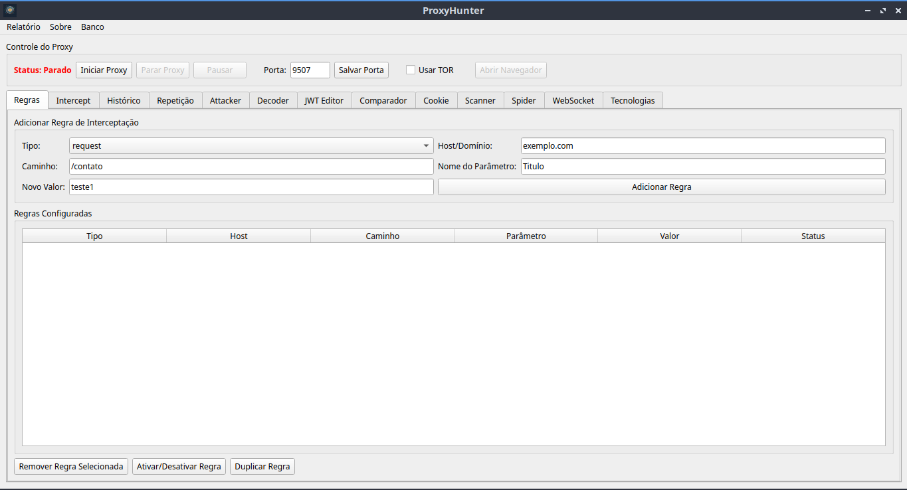

# ProxyHunter

Intercepta requisições HTTP para um determinado domínio e altera parâmetros específicos antes de enviar a requisição.

## Descrição

Aplicação Python com interface gráfica que permite configurar regras de interceptação para modificar parâmetros de requisições HTTP. Quando o navegador envia uma requisição para uma rota configurada, o proxy intercepta, modifica apenas os parâmetros especificados e encaminha a requisição mantendo todos os outros parâmetros originais.



## Funcionalidades

- ✅ Interface gráfica intuitiva (PySide6)
- ✅ Configuração de múltiplas regras de interceptação
- ✅ Suporte para GET (query string) e POST (form data)
- ✅ Ativar/desativar regras individualmente
- ✅ Persistência de configurações em JSON
- ✅ **Porta Configurável** - Escolha a porta do proxy (padrão: 9507)
- ✅ **Intercept Manual (Forward/Drop)** - Funcionalidade inspirada no Burp Suite
- ✅ **WebSocket Support** 🔌 - Interceptação e monitoramento de WebSocket:
  - Listagem de conexões WebSocket ativas e fechadas
  - Visualização de mensagens enviadas/recebidas
  - Suporte a mensagens de texto e binárias
  - Histórico completo por conexão
- ✅ **Intruder Avançado** 💥 - Ferramenta completa de ataque automatizado:
  - 4 tipos de ataque (Sniper, Battering Ram, Pitchfork, Cluster Bomb)
  - Múltiplas posições de payload (§markers§)
  - Payload processing (URL encode, Base64, MD5, SHA256, prefix/suffix)
  - Grep extraction (extração de dados via regex)
  - Resource pool management (controle de threads)
- ✅ **Scanner de Vulnerabilidades** 🔐 - Detecção automática de:
  - **Scanner Passivo**: Detecta vulnerabilidades em respostas HTTP
    - SQL Injection (Error-Based)
    - XSS (Cross-Site Scripting)
    - CSRF (Cross-Site Request Forgery)
    - Path Traversal
    - CVEs conhecidas
    - Informações sensíveis expostas
  - **Scanner Ativo**: Testa ativamente endpoints com payloads
    - SQL Injection (Error-Based, Boolean-Based, Time-Based)
    - XSS Refletido
    - Command Injection
    - Scan sob demanda em requisições selecionadas
- ✅ **Spider/Crawler** 🕷️ - Descoberta automática de:
  - URLs e endpoints
  - Formulários e seus campos
  - Estrutura do site (sitemap)
  - Parâmetros de query strings
- ✅ **Comparador de Requisições** 🔀 - Comparação lado a lado:
  - Diff visual de requisições e respostas
  - Highlighting automático de diferenças
  - Útil para encontrar tokens CSRF e mudanças sutis
  - Algoritmo inteligente usando difflib
- ✅ Histórico de requisições com filtros avançados
- ✅ Visualização detalhada de Request/Response
- ✅ Filtros por método HTTP e regex de domínio
- ✅ Interface de Linha de Comando (CLI) para gerenciamento de regras e execução headless
  - ✅ Crawl automatico via CLI (HTTP ou Playwright com JS)
  - ✅ Exportacao de historico e spider em JSON
  - ✅ Scan passivo por ID no historico salvo
  - ✅ **Agente Autônomo Inteligente** 🤖 - Navegação com IA (LLM):
    - Usa Gemini, OpenAI ou Ollama para decidir ações
    - Identifica e preenche formulários automaticamente
    - Mapeia rotas e descobre páginas sozinho
    - Suporta login com credenciais
    - Sessões persistentes (pode retomar depois)

## Roadmap (Ideias de Próximas Funcionalidades)

- ⏳ Sequencer 📊 - Análise de entropia em tokens/sessões
- ⏳ Session Handler 🔄 - Macros de autenticação e auto-reautenticação (renovar tokens expirados)
- ⏳ CORS Checker 🌐 - Teste de misconfigurações CORS
- ⏳ GraphQL Scanner 📈 - Introspecção + fuzzing GraphQL
- ⏳ Importador de APIs 🧩 - OpenAPI/Swagger/Postman/GraphQL para gerar endpoints e payloads
- ⏳ Teste de Autorização 🔐 - IDOR/BOLA com comparação de respostas entre perfis
- ⏳ Param Miner 🧭 - Hidden params, content discovery, dirs, vhosts e arquivos de backup
- ⏳ Scanner OAST 🛰️ - SSRF/Blind XSS/XXE usando o OAST
- ⏳ Subdomain Enumerator 🔍 - Descoberta de subdomínios
- ⏳ WAF Detector 🛡️ - Identificação e tentativas de bypass de WAFs
- ⏳ Notes/Report 📝 - Anotações durante o pentest + exportação de relatório
- ⏳ Scope Manager 🎯 - Definir escopo (in-scope/out-of-scope) para filtrar tráfego


## Tor (Proxy SOCKS5)

Para usar recursos que dependem do Tor, instale e inicie o serviço:

**Linux:**
```bash
sudo apt install tor
sudo systemctl start tor
```

**Windows:**
```powershell
choco install tor
Start-Process tor
```
O proxy SOCKS5 ficará disponível em 127.0.0.1:9050.

---

## Instalação

### Pré-requisitos

- Python 3.7 ou superior
- pip (gerenciador de pacotes Python)

### Passos

1. Clone o repositório:
```bash
git clone https://github.com/pwviptbl/ProxyHunter.git
cd ProxyHunter
```

2. Instale as dependências:
```bash
pip install -r config/requirements.txt
```

### Ambiente Virtual

Para isolar as dependências do projeto, é recomendado usar um ambiente virtual.

1. Criar o ambiente virtual:
```bash
python -m venv .venv
```

2. Ativar o ambiente virtual:
   - No Windows:
```bash
.venv\Scripts\activate
```
   - No Linux/Mac:
```bash
source .venv/bin/activate
```

3. Para desativar:
```bash
deactivate
```

> 💡 Lembre-se de ativar o ambiente virtual antes de instalar as dependências e executar o projeto.

## Build do Executável Standalone

Para criar um executável standalone com ícone personalizado que pode ser distribuído sem instalar Python:

1. Instale o PyInstaller:
```bash
pip install pyinstaller
```

2. Execute o comando de build (adapte conforme seu sistema operacional):

   **Windows:**
   ```bash
   .venv\Scripts\activate
   pyinstaller --onefile --windowed --icon=imagens/icone_sfundo.png --paths=. --exclude PyQt5 --add-data "imagens/icone_sfundo.png;imagens/" --add-data "imagens/Principal.png;imagens/" scripts/pyside_proxy.py
   ```

   **Linux/Mac:**
   ```bash
   source .venv/bin/activate
   pyinstaller --onefile --windowed --icon=imagens/icone_sfundo.png --paths=. --exclude PyQt5 --add-data "imagens/icone_sfundo.png:imagens/" --add-data "imagens/Principal.png:imagens/" scripts/pyside_proxy.py
   ```

3. O executável será gerado em `dist/`:
   - **Windows**: `dist/pyside_proxy.exe`
   - **Linux/Mac**: `dist/pyside_proxy` (arquivo binário sem extensão)

> 💡 **Nota**: O executável inclui uma tela de loading (splash screen) compacta com a imagem `Principal.png` que aparece por 3 segundos durante o carregamento da aplicação.
> 
> 💡 **Nota**: O executável é autocontido e pode ser movido/copiado para qualquer local ou computador compatível sem precisar do ambiente Python original.
> 
> 💡 **Nota para Linux**: O ícone na barra de tarefas depende do desktop environment (GNOME, KDE, etc.) e pode não aparecer exatamente como no Windows, mas a aplicação funcionará normalmente.

## Uso

### 1. Iniciar a Aplicação

Execute o script de instalação que criará o ambiente virtual e instalará as dependências automaticamente:

- **Windows**: Clique duas vezes em `ProxyHunter-GUI.bat` ou execute no terminal:
```cmd
ProxyHunter-GUI.bat
```

- **Linux/Mac**: Execute no terminal:
```bash
chmod +x ProxyHunter-GUI.sh
./ProxyHunter-GUI.sh
```

O script irá:
1. Criar um ambiente virtual (se não existir)
2. Instalar as dependências necessárias
3. Iniciar a interface gráfica PySide6

> 💡 **Dica**: Nas execuções subsequentes, o script detectará o ambiente virtual existente e apenas iniciará a aplicação.

### 2. Configurar Regras de Interceptação

Na interface gráfica, vá para a aba **"Regras de Interceptação"**:

1. **Host/Domínio**: Digite o domínio a ser interceptado (ex: `exemplo.com`)
2. **Caminho**: Digite o caminho da rota (ex: `/contato`)
3. **Nome do Parâmetro**: Digite o nome do parâmetro a ser modificado (ex: `Titulo`)
4. **Novo Valor**: Digite o valor que substituirá o original (ex: `teste1`)
5. Clique em **"Adicionar Regra"**

### 3. Visualizar Histórico de Requisições

Na aba **"Histórico de Requisições"**:

1. **Filtros**: Use os filtros para encontrar requisições específicas
   - Filtrar por método (GET, POST, etc.)
   - Filtrar por domínio usando regex (ex: `google.com|facebook.com`)
2. **Lista**: Veja todas as requisições capturadas com host, data, hora, método e status
3. **Detalhes**: Clique em uma requisição para ver detalhes completos
   - Aba "Request": Headers e body da requisição
   - Aba "Response": Status, headers e body da resposta

Para mais informações sobre o histórico, veja [docs/HISTORY_GUIDE.md](docs/HISTORY_GUIDE.md)

### 3.0. Configurar a Porta do Proxy

Por padrão, o proxy escuta na porta 9507, mas você pode configurar qualquer porta entre 1 e 65535.

#### Via Interface Gráfica:

1. No frame **"Controle do Proxy"** (parte superior da janela):
   - Veja o campo **"Porta"** com o valor atual
   - Digite a nova porta desejada
   - Clique em **"Salvar Porta"**
2. **Importante**: O proxy deve estar parado para alterar a porta
3. A configuração é salva automaticamente e será usada na próxima execução

#### Via Linha de Comando:

```bash
# Ver a porta configurada
python cli.py get-port

# Definir uma nova porta
python cli.py set-port 9090

# Iniciar o proxy com a porta configurada
python cli.py run

# Ou iniciar com uma porta específica (temporária)
python cli.py run --port 9090
```

> 💡 **Dica**: Ao alterar a porta, lembre-se de atualizar também as configurações do seu navegador para usar a nova porta.

### 3.X. CLI (Crawl + Historico)

Para usar a CLI com ambiente virtual e dependencias automaticas:

```bash
chmod +x ProxyHunter-CLI.sh
./ProxyHunter-CLI.sh --help
```

#### Crawl simples (HTTP)
```bash
./ProxyHunter-CLI.sh crawl --url http://example.com --depth 2 --max-pages 200 --max-forms 200
```

#### Crawl com navegador (Playwright, JS)
```bash
./ProxyHunter-CLI.sh crawl --url example.com --depth 3 --max-pages 200 --max-forms 200 --browser
```

#### Listar historico salvo
```bash
./ProxyHunter-CLI.sh history list --file logs/cli_history.json --limit 50
```

#### Scan passivo por ID
```bash
./ProxyHunter-CLI.sh scan-passive 3 --file logs/cli_history.json
```

#### Scan ativo por ID
```bash
./ProxyHunter-CLI.sh scan-active 3 --file logs/cli_history.json
```

#### Scan passivo + ativo (mesmo ID)
```bash
./ProxyHunter-CLI.sh scan-both 3 --file logs/cli_history.json
```

#### Scan passivo + ativo por dominio
```bash
./ProxyHunter-CLI.sh scan-both-domain example.com --file logs/cli_history.json
```

#### Relatorio em Markdown
```bash
./ProxyHunter-CLI.sh report-md --domain example.com --file logs/cli_history.json --out logs/report.md
```

### 3.Y. Agente Autônomo Inteligente 🤖

O agente autônomo usa **IA (LLM)** para navegar em sites como um humano faria - identificando elementos, preenchendo formulários e mapeando rotas automaticamente. Captura TODAS as requisições e salva automaticamente.

#### Navegação simples (explorar site)
```bash
./ProxyHunter-CLI.sh agent http://example.com
```

#### Com objetivo específico
```bash
./ProxyHunter-CLI.sh agent http://example.com -o "explorar páginas e preencher formulários"
```

#### Com credenciais para login
```bash
./ProxyHunter-CLI.sh agent http://example.com -o "fazer login e mapear área logada" -u admin -p secret
```

#### Ver navegador (modo visual)
```bash
./ProxyHunter-CLI.sh agent http://example.com --headful
```

**Arquivos gerados:**
- `logs/cli_history.json` - Histórico de requisições (compatível com scan-passive/active)
- `logs/cli_spider.json` - Rotas descobertas

**Configuração do LLM** (`config/ai_config.json`):
```json
{
    "provider": "gemini",
    "api_key": "YOUR_API_KEY",
    "model": "gemini-2.0-flash",
    "max_steps": 50
}
```

**Providers suportados:**
- **Gemini** (padrão) - Configure `GEMINI_API_KEY` ou `config/ai_config.json`
- **OpenAI** - Configure `OPENAI_API_KEY` ou `config/ai_config.json`
- **Ollama** - Local, sem API key necessária
- **GitHub Copilot** 🆕 - Usa OAuth Device Flow (gratuito para assinantes Copilot)

#### Autenticação GitHub Copilot 🔐

O GitHub Copilot permite usar modelos como `gpt-4o`, `claude-sonnet-4`, `gemini-2.5-pro` **gratuitamente** (para assinantes) via autenticação OAuth.

**1. Fazer Login (uma única vez):**
```bash
cd /home/kali/Modelos/ProxyHunter
source .venv/bin/activate
python3 -c "from src.core.auth.github_auth import GitHubAuth; GitHubAuth().authenticate()"
```

O processo vai:
1. Abrir automaticamente o navegador em `https://github.com/login/device`
2. Mostrar um código no terminal (ex: `ABCD-1234`)
3. Cole o código no navegador e autorize
4. O token será salvo automaticamente em `.github_oauth_token.json`

**2. Configurar `config/ai_config.json`:**
```json
{
    "provider": "github-copilot",
    "model": "gpt-4o",
    "temperature": 0.3,
    "max_steps": 50
}
```

**3. Modelos disponíveis via Copilot:**

| Modelo | Custo | Descrição |
|--------|-------|-----------|
| `gpt-4o` | 0x (gratuito) | Rápido, bom para tarefas gerais |
| `gpt-5-mini` | 0x (gratuito) | Otimizado para tarefas leves |
| `claude-haiku-4.5` | 0.33x | Bom para organizar contexto |
| `claude-sonnet-4` | 1x | Raciocínio equilibrado |
| `gemini-2.5-pro` | 1x | Multimodal, análise de imagens |
| `gpt-5` | 1x | Modelo principal OpenAI |

**4. Verificar status da autenticação:**
```bash
python3 -c "from src.core.auth.github_auth import GitHubAuth; auth = GitHubAuth(); print(auth.get_status())"
```
- `CONNECTED` = Pronto para usar
- `DISCONNECTED` = Precisa fazer login

> ⚠️ **Nota**: Sem credenciais, o agente preenche formulários com dados aleatórios para mapear rotas.


> 💡 **Nota**: A pasta `logs/` e os arquivos de historico/spider sao gerados automaticamente e estao no `.gitignore`.


### 3.1. Intercept Manual (Forward/Drop)

Na aba **"Intercept Manual"**, você pode pausar requisições e modificá-las manualmente antes de enviá-las:

1. **Ativar Intercept**: 
   - Clique no botão "Intercept is OFF" para ativar
   - O botão ficará verde: "Intercept is ON"
   
2. **Interceptar Requisição**:
   - Quando uma requisição for feita, ela aparecerá na aba
   - Você verá: Método, URL, Headers e Body
   
3. **Modificar Requisição**:
   - Edite os headers no campo "Headers"
   - Edite o body no campo "Body"
   
4. **Tomar Ação**:
   - **Forward**: Envia a requisição (com suas modificações)
   - **Drop**: Cancela a requisição (não envia ao servidor)

5. **Desativar Intercept**:
   - Clique em "Intercept is ON" para desativar
   - As requisições voltarão a passar normalmente

> 💡 **Dica**: Esta funcionalidade é inspirada no Burp Suite e é ideal para testes manuais de segurança e análise de requisições.

Para mais informações sobre o Intercept Manual, veja [docs/INTERCEPT_MANUAL_FEATURE.md](docs/INTERCEPT_MANUAL_FEATURE.md)

### 3.1.5. Intruder Avançado (Ataques Automatizados) 💥

Na aba **"💥 Intruder"**, você pode realizar ataques automatizados com múltiplas requisições:

1. **Marcar Posições de Payload**:
   - Use `§...§` para marcar onde inserir payloads
   - Exemplo: `GET /login?user=§admin§&pass=§123§`
   - Selecione texto e clique "📋 Marcar Posições" para facilitar

2. **Escolher Tipo de Ataque**:
   - **Sniper**: Testa cada posição individualmente (fuzzing)
   - **Battering Ram**: Mesmo payload em todas as posições
   - **Pitchfork**: Combina sets em paralelo (credenciais)
   - **Cluster Bomb**: Todas as combinações possíveis (brute-force)

3. **Configurar Payloads**:
   - **Payload Set 1**: Arquivo .txt com payloads (obrigatório)
   - **Payload Set 2**: Arquivo .txt adicional (para Pitchfork/Cluster Bomb)

4. **Processamento** (opcional):
   - ✓ URL Encode, Base64, MD5 Hash
   - Prefix/Suffix para adicionar texto aos payloads

5. **Grep Extraction** (opcional):
   - Use regex para extrair dados das respostas
   - Exemplo: `token=([a-zA-Z0-9]+)` para capturar tokens

6. **Iniciar Ataque**:
   - Ajuste threads (padrão: 10)
   - Clique "▶ Iniciar Ataque"
   - Monitore resultados em tempo real

**Exemplo de Uso - Brute Force**:
```
POST /login HTTP/1.1
Host: example.com
Content-Type: application/x-www-form-urlencoded

username=§admin§&password=§password§
```

Com Pitchfork e dois arquivos (users.txt e passwords.txt), você testa combinações específicas.

> 💡 **Dica**: O Intruder é poderoso! Use com responsabilidade e apenas em ambientes autorizados.

Para mais informações detalhadas, veja [docs/INTRUDER_GUIDE.md](docs/INTRUDER_GUIDE.md)

### 3.2. Spider/Crawler (Descoberta Automática)

Na aba **"🕷️ Spider/Crawler"**, você pode descobrir automaticamente páginas, endpoints e formulários:

1. **Iniciar o Proxy**: 
   - Primeiro, certifique-se de que o proxy está em execução
   
2. **Configurar o Spider**:
   - **URL Inicial**: Digite a URL base do site a mapear (ex: `http://exemplo.com`)
   - **Profundidade Máxima**: Número de níveis de links a seguir (padrão: 3)
   - **Máximo de URLs**: Limite de URLs a descobrir (padrão: 1000)
   
3. **Iniciar Spider**:
   - Clique em "▶ Iniciar Spider"
   - O spider começará a descobrir automaticamente quando você navegar no site
   
4. **Navegar no Site**:
   - Use seu navegador normalmente
   - O spider analisará automaticamente as respostas HTML
   - Links, formulários e endpoints serão descobertos
   
5. **Visualizar Descobertas**:
   - **URLs Descobertas**: Lista de todas as URLs encontradas
   - **Formulários**: Tabela com formulários, métodos e campos de entrada
   - **Sitemap**: Estrutura do site organizada por host e paths
   
6. **Exportar**:
   - Use o botão "💾 Exportar" para salvar o sitemap em arquivo
   - Use "📋 Copiar Todas" para copiar as URLs para a área de transferência
   
7. **Parar Spider**:
   - Clique em "⏹ Parar Spider" quando terminar
   - Use "🗑 Limpar Dados" para resetar os resultados

> 💡 **Dica**: O Spider funciona passivamente analisando as respostas do proxy. Quanto mais você navegar pelo site, mais completo será o mapeamento!

### 3.3. Scanner Ativo (Detecção Avançada de Vulnerabilidades)

Na aba **"Scanner 🔐"**, você pode executar scans ativos em requisições específicas:

1. **Scanner Passivo (Automático)**:
   - Funciona automaticamente em todas as requisições
   - Analisa respostas HTTP em busca de padrões conhecidos
   - Detecta: SQL Injection (erros), XSS, CSRF, Path Traversal, CVEs, informações sensíveis
   
2. **Scanner Ativo (Manual)**:
   - Testa ativamente enviando payloads específicos
   - **Como usar**:
     1. Vá para a aba "Histórico de Requisições"
     2. Selecione uma requisição para testar
     3. Volte para a aba "Scanner 🔐"
     4. Clique em "🔍 Scan Ativo"
     5. Aguarde a conclusão do scan
     6. Visualize as vulnerabilidades encontradas na lista

3. **Tipos de Vulnerabilidades Detectadas pelo Scanner Ativo**:
   - **SQL Injection**:
     - Error-Based: Detecta erros SQL na resposta
     - Boolean-Based: Compara respostas TRUE vs FALSE
     - Time-Based: Detecta delays (SLEEP, WAITFOR)
   - **XSS Refletido**: Verifica se payloads são refletidos na resposta
   - **Command Injection**: Testa execução de comandos do sistema
   
4. **Visualizar Resultados**:
   - Vulnerabilidades aparecem na lista com severidade (Critical/High/Medium/Low)
   - Clique em uma vulnerabilidade para ver detalhes completos
   - Use filtros para organizar por severidade ou tipo

> ⚠️ **Aviso Importante**: O Scanner Ativo envia múltiplas requisições com payloads de teste. Use APENAS em:
> - ✅ Seus próprios sistemas ou aplicações
> - ✅ Ambientes de teste autorizados
> - ✅ Com permissão explícita
> 
> NÃO use em sistemas de terceiros sem autorização!

### 4. Iniciar o Proxy

Clique no botão **"Iniciar Proxy"**. O servidor será iniciado na porta configurada (padrão: 9507).

### 5. Configurar o Navegador

Configure seu navegador para usar o proxy:

- **Host/IP**: `localhost` ou `127.0.0.1`
- **Porta**: A porta configurada (padrão: `9507`)

> 💡 Para interceptar tráfego HTTPS é obrigatório instalar o certificado raiz do mitmproxy. Com o proxy em execução, acesse `http://mitm.it`, baixe o certificado para o seu sistema/navegador e instale-o na lista de autoridades confiáveis. Reinicie o navegador depois dessa etapa.

#### Exemplo no Firefox:
1. Configurações → Geral → Configurações de Rede
2. Configurar Proxy Manualmente
3. HTTP Proxy: `localhost`, Porta: a porta configurada (ex: `9507`)
4. Marcar "Usar este proxy para todos os protocolos"

#### Exemplo no Chrome:
Use as configurações de sistema ou extensões como "Proxy SwitchyOmega"

### 6. Navegação

Navegue normalmente. Quando acessar uma URL que corresponda às regras configuradas, os parâmetros serão automaticamente substituídos.

### Uso via Linha de Comando (CLI)

A aplicação também pode ser controlada via terminal usando `scripts/cli.py`.

#### Listar Regras
```bash
python scripts/cli.py list
```

#### Adicionar uma Regra
```bash
python scripts/cli.py add --host exemplo.com --path /login --param user --value admin
```

#### Remover uma Regra
Use o índice (o número # da lista) para remover.
```bash
python scripts/cli.py remove 1
```

#### Ativar/Desativar uma Regra
Use o índice para ativar ou desativar.
```bash
python scripts/cli.py toggle 1
```

#### Configurar a Porta
```bash
# Ver a porta atual
python scripts/cli.py get-port

# Definir uma nova porta
python scripts/cli.py set-port 9090
```

#### Iniciar o Proxy (Headless)
```bash
# Inicia com a porta configurada
python scripts/cli.py run

# Ou especifica uma porta temporária
python scripts/cli.py run --port 9090
```

#### Enviar Requisições em Massa (Sender)
Para automatizar testes de carga ou fuzzing, use o comando `send`. Crie um arquivo `lista.txt` com um valor por linha.

```bash
# Exemplo de conteúdo para lista.txt
valor1
valor2
valor3
```

```bash
python scripts/cli.py send --url http://exemplo.com/api --file lista.txt --param userID --threads 10
```
Este comando enviará requisições para `http://exemplo.com/api?userID=valor1`, `.../api?userID=valor2`, etc., usando 10 threads simultâneas.

#### Obter Informações do Sistema
Para ajudar a decidir o número de threads, use o comando `info`.
```bash
python scripts/cli.py info
```

## Exemplo de Uso

**Configuração:**
- Host: `exemplo.com`
- Caminho: `/contato`
- Parâmetro: `Titulo`
- Valor: `teste1`

**Comportamento:**

Quando você acessar `exemplo.com/contato?Titulo=original&Nome=João`, o proxy irá modificar para:
`exemplo.com/contato?Titulo=teste1&Nome=João`

O parâmetro `Titulo` é substituído por `teste1`, mas o parâmetro `Nome` permanece com seu valor original.

## Estrutura de Arquivos

```
ProxyHunter/
├── scripts/                # Scripts executáveis
│   ├── cli.py             # Ponto de entrada para a CLI
│   └── pyside_proxy.py    # Ponto de entrada para a GUI PySide6
├── ProxyHunter-GUI.sh   # Script de instalação para Linux/Mac
├── ProxyHunter-GUI.bat  # Script de instalação para Windows
├── src/                   # Código fonte
│   ├── core/              # Lógica principal do proxy
│   └── ui/                # Interface gráfica
├── config/                # Arquivos de configuração
│   ├── requirements.txt   # Dependências
│   └── intercept_config.example.json  # Configuração de exemplo
├── docs/                  # Documentação
├── examples/              # Exemplos de uso
├── test/                  # Testes
└── README.md
```

## Gerenciamento de Regras

- **Adicionar Regra**: Preencha os campos e clique em "Adicionar Regra"
- **Remover Regra**: Selecione uma regra na lista e clique em "Remover Regra Selecionada"
- **Ativar/Desativar**: Selecione uma regra e clique em "Ativar/Desativar Regra"

## Tecnologias Utilizadas

- **Python 3**: Linguagem de programação
- **PySide6**: Interface gráfica moderna
- **mitmproxy**: Servidor proxy HTTP/HTTPS com capacidade de interceptação
- **JSON**: Armazenamento de configurações

## Observações

- O proxy intercepta apenas requisições HTTP. Para HTTPS, você precisará instalar o certificado CA do mitmproxy no navegador
- As configurações (regras e porta) são salvas automaticamente no arquivo `intercept_config.json`
- O proxy mantém todos os parâmetros não configurados com seus valores originais
- A porta padrão é 9507, mas pode ser alterada a qualquer momento via interface ou CLI
- **NOVO:** A atividade do proxy (regras aplicadas, erros) é registrada no arquivo `proxy.log` para facilitar a depuração.

## Solução de Problemas

### Certificado HTTPS
Se precisar interceptar HTTPS, instale o certificado do mitmproxy:
1. Com o proxy rodando, acesse: http://mitm.it
2. Siga as instruções para instalar o certificado no seu sistema
3. Reinicie o navegador para que ele reconheça a nova autoridade

### Porta já em uso
Se a porta padrão (9507) ou a porta configurada já estiver em uso, você tem algumas opções:

**Opção 1 - Alterar a Porta via Interface Gráfica:**
1. Certifique-se de que o proxy está parado
2. No frame "Controle do Proxy", altere o valor no campo "Porta"
3. Clique em "Salvar Porta"
4. Inicie o proxy novamente

**Opção 2 - Alterar a Porta via CLI:**
```bash
python cli.py set-port 9090
python cli.py run
```

**Opção 3 - Usar Porta Temporária (CLI):**
```bash
# Usa a porta 9090 apenas para esta execução
python cli.py run --port 9090
```

## Licença

Este projeto é licenciado sob a licença Non-Commercial (custom). Veja `LICENSE`.
